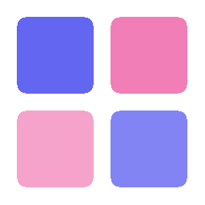

<p align="center">
  
</p>

<h1 align="center">Anima — Pixel Art Studio</h1>

<p align="center">
  <strong>Editor de pixel art y animación sprite de escritorio, construido con Electron.</strong>
</p>

<p align="center">
  
  
  
</p>

---

## Descripción

**Anima** es un editor de pixel art completo y liviano, diseñado para artistas de sprites y animación 2D. Permite crear, editar y animar sprites pixel a pixel con una interfaz moderna e intuitiva. Guardar y abrir proyectos `.anima` directamente en disco, exportar a PNG, JPEG y spritesheets, todo desde una sola aplicación de escritorio.

---

## Funcionalidades

### 🎨 Herramientas de Dibujo
- **Lápiz** (B) — Dibujo pixel a pixel con tamaño de brush configurable (1–500px)
- **Borrador** (E) — Borra píxeles con tamaño ajustable
- **Rellenar** (G) — Flood fill para rellenar áreas rápidamente
- **Cuentagotas** (I) — Captura cualquier color del lienzo
- **Texto** (T) — Insertar texto con fuente, tamaño y color personalizables

### 📐 Figuras Geométricas
- **Línea** (L) — Dibujar líneas rectas pixel-perfect
- **Rectángulo** (R) — Rectángulos con bordes redondeados opcionales
- **Círculo** (C) — Círculos y elipses pixelados

### ✂️ Selección y Transformación
- **Selector** (S) — Selección rectangular con copiar, cortar y pegar
- **Varita Mágica** (W) — Selección por color con tolerancia ajustable (0–255) y modo contiguo/global
- **Mover** (M) — Mover capas o selecciones libremente

### 🖼️ Capas
- Sistema de capas con **carpetas** para organización
- **Opacidad** individual por capa (0–100%)
- **Combinar** capas hacia abajo
- **Drag & drop** para reordenar capas y carpetas
- **Renombrar** capas con doble clic
- Selección múltiple de capas

### 🎬 Animación
- **Timeline** con frames ilimitados
- Reproducción en tiempo real con **FPS configurable** (1–60)
- **Onion Skin** para ver frames anteriores superpuestos
- **Preview** de animación en vivo
- Duplicar y eliminar frames
- Exportar como **spritesheet** (sprite atlas)

### 🦴 Rigging (Experimental)
- Crear **huesos** sobre el sprite
- Pintar **pesos de influencia** por píxel
- Modo de **animación** con deformación en tiempo real
- Auto-asignar pesos al hueso más cercano

### 🔧 Herramientas de Productividad
- **Deshacer/Rehacer** ilimitado (Ctrl+Z / Ctrl+Y) — aplica a todas las herramientas
- **Mirror horizontal y vertical** para dibujo simétrico
- **Cuadrícula** configurable (toggle con G)
- **Zoom** con lupa, scroll wheel y atajos (Ctrl+/Ctrl-)
- **Pan** con herramienta mano (H) o clic medio del ratón
- **Pestañas** múltiples para trabajar en varios proyectos a la vez

### 🎨 Gestión de Color
- Color primario y secundario con selector visual
- **Paleta de colores** predeterminada
- **Paleta personalizada** que se llena automáticamente con los colores que usas
- Intercambiar colores primario/secundario

### 💾 Archivos y Exportación
- Formato nativo `.anima` (JSON) para guardar proyectos completos
- **Guardar** (Ctrl+S) — sobrescribe automáticamente si el archivo ya existe
- **Guardar como** (Ctrl+Shift+S) — siempre muestra diálogo para nueva ubicación
- **Abrir** archivos `.anima`, PNG y JPEG
- Exportar a **PNG** (transparencia) y **JPEG**
- Exportar **spritesheet** con todos los frames

### ⌨️ Atajos de Teclado

| Atajo | Acción |
|---|---|
| `B` | Lápiz |
| `E` | Borrador |
| `G` | Rellenar |
| `I` | Cuentagotas |
| `L` | Línea |
| `R` | Rectángulo |
| `C` | Círculo |
| `S` | Selector |
| `W` | Varita Mágica |
| `M` | Mover |
| `T` | Texto |
| `Z` | Zoom In |
| `Shift+Z` | Zoom Out |
| `H` | Mano (pan) |
| `O` | Onion Skin |
| `Ctrl+Z` | Deshacer |
| `Ctrl+Y` | Rehacer |
| `Ctrl+S` | Guardar |
| `Ctrl+Shift+S` | Guardar como |
| `Ctrl+O` | Abrir |
| `Ctrl+N` | Nuevo proyecto |
| `Ctrl+C` | Copiar selección |
| `Ctrl+X` | Cortar selección |
| `Ctrl+V` | Pegar |
| `Ctrl+W` | Cerrar pestaña |
| `Espacio` | Play/Pausa animación |
| `Esc` | Deseleccionar |

---

## Instalador de Windows

### Descargar

Descarga el instalador más reciente desde la sección [Releases](https://github.com/soldierB0y/Anima/releases):

> **[⬇️ Descargar anima-1.0.0-setup.exe](https://github.com/soldierB0y/Anima/releases/latest)**

### Instalar

1. Descarga `anima-1.0.0-setup.exe`
2. Ejecuta el instalador
3. Sigue los pasos del asistente de instalación (NSIS)
4. Se creará un acceso directo en el escritorio automáticamente
5. ¡Listo! Abre **Anima** desde el escritorio o el menú Inicio

### Desinstalar

Desde **Configuración > Aplicaciones > Anima** o ejecutando el desinstalador desde la carpeta de instalación.

---

## Compilar el Instalador

Si querés generar el instalador vos mismo:

### Requisitos

- [Node.js](https://nodejs.org/) v18 o superior
- npm (incluido con Node.js)

### Pasos

```bash
# 1. Clonar el repositorio
git clone https://github.com/soldierB0y/Anima.git
cd Anima

# 2. Instalar dependencias
npm install

# 3. Compilar el instalador de Windows
npm run build:win
```

El instalador se generará en la carpeta `dist/`:

```
dist/
  anima-1.0.0-setup.exe    ← Instalador NSIS
```

### Otros sistemas operativos

```bash
# macOS
npm run build:mac

# Linux (AppImage, Snap, deb)
npm run build:linux
```

---

## Desarrollo

```bash
# Instalar dependencias
npm install

# Iniciar en modo desarrollo (hot reload)
npm run dev

# Compilar sin empaquetar
npm run build

# Preview de la build
npm start
```

---

## Estructura del Proyecto

```
Anima/
├── build/                  # Recursos de build (iconos)
├── resources/              # Assets del proceso principal
├── src/
│   ├── main/index.js       # Proceso principal de Electron
│   ├── preload/index.js    # Bridge entre main y renderer
│   └── renderer/
│       ├── index.html      # Interfaz principal
│       ├── assets/
│       │   ├── main.css    # Estilos globales
│       │   └── icon.png    # Favicon
│       └── src/
│           └── renderer.js # Toda la lógica de la app
├── electron-builder.yml    # Configuración del instalador
├── electron.vite.config.mjs
└── package.json
```

---

## Tecnologías

- **[Electron](https://www.electronjs.org/)** — Framework de escritorio multiplataforma
- **[electron-vite](https://electron-vite.org/)** — Build tool optimizado para Electron
- **[electron-builder](https://www.electron.build/)** — Empaquetado y distribución
- **Canvas API** — Renderizado pixel-perfect
- **Vanilla JavaScript** — Sin frameworks, máximo rendimiento

---

## Autor

**SoldierB0y** — [@soldierB0y](https://github.com/soldierB0y)

---

<p align="center">
  Hecho con ❤️ para artistas pixel
</p>
